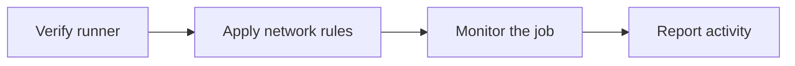

# How Fence Works 🔧

Fence is a GitHub Action with a bundled Rust agent. It runs before the rest of your workflow, applies the runner's network and security rules, and keeps checking those rules until the job finishes.

## Job Lifecycle

1. **Start:** Fence verifies the runner and the bundled agent.
2. **Configure:** It combines the GitHub connections needed by the runner with your `allowlist`.
3. **Protect:** Block mode restricts outbound traffic and turns off passwordless `sudo` and Docker.
4. **Monitor:** The agent checks the runner throughout the job.
5. **Report:** The post-job step summarizes network activity and fails the job if a security control changed unexpectedly.



Fence does not restore network or privilege access at the end of a job. GitHub discards the hosted runner instead.

## Block And Audit Modes

Block mode is the default. It allows required runner connections and your configured destinations, blocks everything else, and disables passwordless `sudo` and Docker.

Audit mode shows what block mode would reject without blocking traffic or changing `sudo` and Docker access. Use it to work out which destinations a job needs.

You can optionally keep Docker with `container_policy: unsafe_preserve` or enable GitHub artifacts with `allow_github_artifacts: true`. Both options reduce the default security guarantees, so use them only when required.

## Network Reports

Fence reports network activity in two places:

- The GitHub job summary contains a human-readable activity table.
- The post-job log contains the same activity and one machine-readable `FENCE_REPORT_JSON=` line.

The report tells you which destinations were allowed, blocked, or observed in audit mode. It includes control status, warnings, and recommended audit-mode allowlist entries. Fence limits the report to 20 destinations, keeps the complete JSON record under 16 KiB, and does not include secrets, environment variables, command arguments, or packet contents.

### Fetch A Report

First, find the job ID:

```bash
gh api repos/OWNER/REPO/actions/runs/RUN_ID/jobs \
  --jq '.jobs[] | {id, name}'
```

Then extract and pretty-print the report:

```bash
gh api repos/OWNER/REPO/actions/jobs/JOB_ID/logs \
  | sed -n 's/^.*FENCE_REPORT_JSON=//p' \
  | jq .
```

Fence writes the report as one compact line in the job log. The command above formats it for reading:

```json
{
  "schema_version": 1,
  "mode": "audit",
  "result": "healthy",
  "controls": {
    "network": "verified",
    "sudo": "preserved_verified",
    "containers": "preserved_verified",
    "protection_available": false,
    "readiness": "ready_observation_only",
    "resident_health": "healthy"
  },
  "network": [
    {
      "destination_kind": "hostname",
      "destination": "api.example.com",
      "decision": "would_block",
      "activities": [
        {
          "kind": "dns_query",
          "query_type": "a",
          "count": 1
        },
        {
          "kind": "connection_attempt",
          "protocol": "tcp",
          "port": 443,
          "count": 2
        }
      ],
      "actors": [
        {
          "label": "runner: curl (PID 4242)",
          "count": 2
        }
      ],
      "count": 3
    }
  ],
  "warnings": {
    "critical_findings": 0,
    "critical_codes": [],
    "materialization_rejections": 0,
    "wildcard_rejections": 0,
    "wildcard_authorizations_truncated": false,
    "results_storage_attribution_failures": 0,
    "results_storage_rejections": 0,
    "results_storage_authorizations_truncated": false,
    "github_artifact_uploads_enabled": false,
    "github_artifact_authorizations": 0
  },
  "omissions": {
    "network_rows": 0,
    "hostname_recommendations": 0,
    "ip_recommendations": 0,
    "actor_entries": 0,
    "activity_entries": 0,
    "critical_codes": 0,
    "unparsed_findings": 0,
    "dns_evidence_missing": false,
    "source_truncated": false,
    "byte_budget_exceeded": false
  },
  "suggested_allowlist": [
    "api.example.com"
  ]
}
```

Anyone who can read the workflow job log can read the report. In audit mode, `would_block` means a request was observed, not denied. In block mode, a blocked request is expected and does not make an otherwise healthy job a warning.

For implementation details and the complete security contract, see the [v0 specification](v0.md), [threat model](threat-model.md), and [security guide](security.md).
