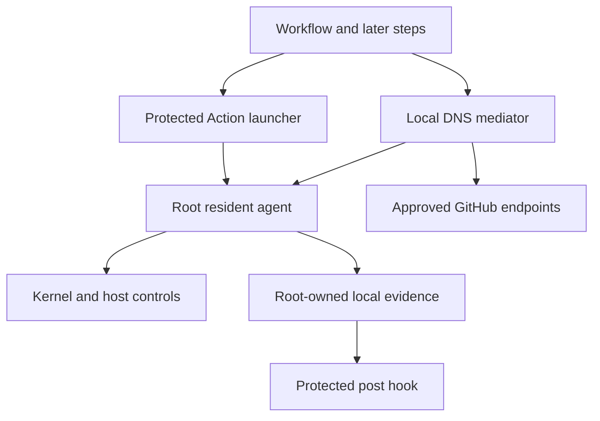

# Fence v0 Threat Model

This document explains what Fence protects, what it trusts, and what remains outside its security guarantees. It is intended for workflow authors, maintainers, and security reviewers.

Review this threat model before changing the supported runners, platform profile, launcher, privilege controls, evidence format, or public security claims. The [v0 specification](v0.md) defines the full contract; the [implementation history](history.md) explains how Fence reached its current design.

Fence uses a schema-`9` policy and schema-`5` runtime evidence. The `main` branch contains source code only. Each published Action includes the reviewed wrapper, the exact agent binary, and a schema-`4` manifest in a signed distribution commit. The wrapper rejects outdated evidence, stale verification, malformed wildcard records, missing workers, and agent processes that do not match the running `systemd` service. Changes to this contract must update the agent, wrapper, tests, and version together in one reviewed pull request.

## Executive summary

Fence protects GitHub-hosted x64 jobs running `ubuntu-24.04` or `ubuntu-latest` when it runs as the first workflow step. Releases test block and audit modes on both runner labels. Fence verifies the runner's security controls instead of requiring a fixed image fingerprint.

The main risks are how Fence starts its root-owned agent, translates DNS responses into firewall rules, removes sudo and container access, and verifies its post-job evidence. Fence limits outbound network access, but it cannot stop data from being sent to allowed GitHub services, user-approved destinations, or services sharing an allowed IP address.

Azure WireServer at `168.63.129.16` on TCP ports `80` and `32526` is limited to root-owned host processes. Azure Instance Metadata Service at `169.254.169.254:80` remains available to host and forwarded traffic, including later workflow steps. Standard block mode depends on removing sudo and container access so untrusted steps cannot reach root-only services; audit mode and `unsafe_preserve` do not make the same containment claim.

## Scope and assumptions

Fence covers:

- The GitHub Action wrapper and bundled Linux agent in `action/`.
- Configuration, DNS mediation, `nftables`, NFLOG, privilege lockdown, runtime storage, service supervision, and local attribution in `src/`.
- Hosted-runner checks in `.github/workflows/integration.yml` and `.github/workflows/action-acceptance.yml`.
- Release and bundle verification in `.github/workflows/release.yml`, `script/assemble-action-bundle`, and `script/validate-action-bundle`.

This threat model assumes:

- Fence runs before checkout, setup, or other untrusted workflow steps.
- The runner is an ephemeral GitHub-hosted x64 job using `ubuntu-24.04` or `ubuntu-latest` and meets Fence's runner security requirements.
- The hosted image and privileged platform processes have not replaced a trusted executable before Fence captures it. Fence verifies executable identity after capture; it does not authenticate earlier file contents.
- Later workflow steps can run arbitrary commands as the unprivileged `runner` user and may have access to credentials or sensitive source code.
- The Linux kernel, GitHub runner control plane, hosted image supply chain, and GitHub Actions service are trusted.
- Standard block mode uses `container_policy: disable`; `unsafe_preserve` and `audit` provide weaker isolation.
- Fence has no remote control plane, telemetry upload, or runtime agent or policy download.

Fence does not protect against:

- A compromised kernel, hypervisor, or GitHub platform.
- Self-hosted or long-lived runners, ARM, Windows, macOS, or jobs running inside containers.
- Sensitive data sent through approved HTTPS or HTTP destinations.
- Data encoded in allowed wildcard DNS names.
- A malicious step intentionally causing its own job to fail.
- Missing process attribution or a lack of full process isolation.

Adding runner types, supporting job containers, or changing the default GitHub policy requires another threat-model review.

## System model

### Primary components

- **Action launcher:** Validates native inputs, creates root-owned launcher files, protects its runtime with a read-only mount, starts the service, and waits until the agent is ready (`action/main.cts`, `action/lib.cts`).
- **Resident Rust agent:** Checks the service and configuration, applies protections, supervises its workers, and verifies their state every five seconds (`src/cli.rs`, `src/lifecycle.rs`, `src/dns_mediator.rs`).
- **Network controls:** The `nftables` rules, DNS mediator, pinned `Runner.Worker`, and NFLOG reader enforce and record the runner's network policy (`src/nft.rs`, `src/nft_backend.rs`, `src/nflog.rs`).
- **Privilege controls:** Runner security checks, verified privileged executables, effective-access checks, sudo rollback, container shutdown, and root-process inventories prevent common privilege bypasses (`src/hosted_runner.rs`, `src/trusted_executable.rs`, `src/local_control.rs`, `src/lockdown.rs`).
- **Local evidence:** Root-owned readiness files, reports, worker health, and the protected post hook show whether protections remained active (`src/runtime.rs`, `src/findings.rs`, `action/post.cts`).
- **Release verification:** Pinned build inputs, signed distribution commits, acceptance tests, artifact attestations, checksums, and `action-release.json` connect reviewed source commit `M` to published Action commit `D` (`.github/workflows/release.yml`, `script/assemble-action-bundle`).

### Data flows and trust boundaries

- **Workflow author -> Action launcher:** Native inputs or bounded raw JSON configure the Action. The wrapper rejects conflicting inputs; the agent rejects unknown fields and invalid values (`action/lib.cts`, `src/config.rs::parse_and_normalize`).
- **Runner user -> root launcher:** Fixed `sudo` and `systemd-run` commands start one root-owned service. Configuration files are copied to fixed root-owned paths; arbitrary commands and executable paths are rejected (`action/main.cts`, `src/lifecycle.rs`).
- **Root agent -> Linux host controls:** Verified executable descriptors and generated firewall rules can change only reviewed sudo, container, resolver, and `nftables` settings. The runner cannot write those trusted paths, and subprocess output and runtime are bounded (`src/trusted_executable.rs`, `src/lockdown.rs`, `src/nft_backend.rs`, `src/dns_mediator.rs`).
- **Workflow process -> DNS mediator:** A read-only resolver mount sends host DNS queries directly to Fence, while Docker uses a separate local route. Block mode forwards only approved `A` and `AAAA` queries; audit mode observes traffic without claiming containment (`src/dns_mediator.rs`).
- **DNS mediator -> fixed resolver and firewall owner:** local UDP and TCP queries share the bounded root-only UDP resolver path. An approved answer is withheld until all matching transport rules are applied and structurally verified (`src/dns_mediator.rs::MaterializationSubmitter`).
- **Platform compatibility -> GitHub service domains:** Fence permits fixed workflow roots, five exact reviewed static results-storage compatibility accounts, and at most eight single-label `*.githubapp.com` names unless broad GitHub compatibility is disabled. Each resulting HTTPS grant is available to other local code and remains an explicit residual channel (`src/platform_profile.rs`, `src/dns_mediator.rs`).
- **User wildcard policy -> concrete DNS names:** One- and two-label wildcard patterns share a limit of eight hostnames per job. Failed lookups still count because DNS names can carry data. CNAMEs must form one bounded chain rooted at the requested hostname, keep the original policy, and end in a matching address; responses without addresses grant no access (`src/hostname_policy.rs`, `src/dns_mediator.rs`).
- **Pinned runner -> additional GitHub results storage:** by default, Fence accepts up to four other exact results-storage names only when their host DNS sockets belong to the unique pinned `Runner.Worker` identity. The resulting HTTPS grants are also available to other local code (`src/attribution.rs::TrustedRunnerWorker`, `src/dns_mediator.rs`).
- **Explicit artifact compatibility -> additional GitHub results storage:** block-only `allow_github_artifacts: true` permits a uniquely owned host DNS socket belonging to a runner-UID-matching, bounded descendant of the pinned `Runner.Worker` to authorize an exact GitHub-shaped account within the same shared four-account lifetime budget. The distinct `opt_in_github_artifact_dns` origin and verified process ancestry do not authenticate an official action, GitHub's ownership of the account, a signed upload URL, or uploaded contents. Later workflow code can reuse the resulting TCP-`443` access to exfiltrate data (`src/attribution.rs`, `src/dns_mediator.rs`).
- **CNAME lineage -> restricted storage:** exact and wildcard user hostnames cannot derive non-static GitHub results-storage accounts; every restricted account remains subject to the selected default or explicit opt-in attribution boundary and the shared four-account cap.
- **Kernel NFLOG -> resident agent:** Group `4242` copies at most 64 packet bytes. Fence extracts approved endpoint metadata and discards the raw bytes (`src/nflog.rs`, `src/findings.rs`).
- **Finding -> attribution worker:** A queue of up to 128 requests matches local sockets against bounded `/proc` snapshots. Reports include only attribution status, actor class, PID, executable name, and up to four parent executable names (`src/attribution.rs`).
- **Resident agent -> post hook:** The runner can read root-owned readiness and report files but cannot modify them. The post hook verifies the live service, worker health, fresh evidence, wildcard records, rejection counters, protected mounts, and runtime identity before trusting a report (`src/runtime.rs`, `action/post.cts`).
- **Release workflow -> distribution commit:** after all protected checks pass on source commit `M`, the workflow builds the artifact once, assembles the bundle offline, and creates signed child `D` with exactly the two generated bundle files. Full Action acceptance, block and audit checks on both supported runner labels, final-asset attestations, and release-state verification must pass before the immutable tag targets `D` and `action-release.json` exposes it to consumers (`.github/workflows/release.yml`, `script/assemble-action-bundle`).

#### Diagram

## Assets and security objectives

| Asset | Why it matters | Security objective (C/I/A) |
| --- | --- | --- |
| Workflow credentials and tokens | Later steps may receive credentials capable of repository or release changes. | C, I |
| Checked-out source and build outputs | Exfiltration or modification can compromise proprietary source or published artifacts. | C, I |
| Effective network policy | A missing or broader rule changes the core protection claim. | I, A |
| Sudo and container lockdown | Either path can restore root-equivalent authority and bypass network controls. | I |
| Trusted executable and local root-control identity | A replaced privileged command or additive root listener can invalidate the host-control claim. | I |
| Resident agent and protected Action runtime | Replacement can forge evidence, disable monitoring, or restore access. | I, A |
| Local readiness and report evidence | Operators and the post hook use it to decide whether the job remained protected. | I, A |
| Release agent and bundle provenance | A substituted binary compromises every adopting workflow. | I |
| Runner security controls | Unsafe changes to sudo, container, or privileged service access can invalidate lockdown assumptions. | I |

## Attacker model

### Capabilities

- Run arbitrary native code as the later workflow's `runner` user.
- Read workflow-readable files, source, environment values, and credentials.
- Generate DNS and network traffic, including traffic to approved endpoints.
- Race local files and processes before readiness, or modify runner-writable paths after Fence starts.
- Generate large amounts of traffic within Fence's NFLOG, DNS, reporting, and attribution limits.
- Use sudo or Docker before Fence verifies that they are disabled, or use containers when `unsafe_preserve` is explicitly enabled.

### Non-capabilities

- Compromise the Linux kernel, GitHub service, or reviewed hosted-runner image.
- Gain undisclosed root access after Fence starts in standard block mode on a supported runner.
- Modify root-owned runtime files, the read-only Action mount, or the bundled binary after Fence starts without exploiting the kernel or another privileged component.
- Force Fence to inspect encrypted content sent to an approved destination.

## Entry points and attack surfaces

| Surface | How reached | Trust boundary | Notes | Evidence (repo path / symbol) |
| --- | --- | --- | --- | --- |
| Action native inputs | Workflow YAML | Author -> launcher | Bounded strings and multiline allowlist grammar; raw JSON is mutually exclusive. | `action/lib.cts::defaultInlineConfig` |
| Agent configuration | Root-owned config file | Launcher -> root agent | 256 KiB cap, strict schema, typed hostname/IP/CIDR and port validation. | `src/config.rs::read_config_bounded`, `parse_and_normalize` |
| Trusted service entry | `fence run --config` | Root process -> protected lifecycle | Requires root, fixed config path, matching systemd unit and MainPID. | `src/lifecycle.rs::validate_production_service_context` |
| Local DNS UDP/TCP | Host and Docker resolver traffic | Workflow process -> root mediator | Direct host resolver mount, separate Docker routing, canonical bounded queries, fixed listeners, deadlines, policy classification. | `src/dns_mediator.rs::start_dns_proxy` |
| Results-storage DNS | Exact GitHub-shaped storage hostname | Pinned runner -> root mediator; optionally pinned-worker descendant -> root mediator | Default unique `Runner.Worker` identity; explicit artifact opt-in with unique runner-UID-matching socket ownership, revalidated bounded worker ancestry, distinct authorization provenance, strict grammar, one shared four-account cap, and HTTPS-only materialization. Account names do not authenticate GitHub ownership or upload contents. | `src/attribution.rs::TrustedRunnerWorker`, `src/platform_profile.rs::matches_results_storage_hostname`, `src/dns_mediator.rs::requires_runner_results_storage_provenance` |
| NFLOG netlink socket | Owned kernel log group | Kernel -> agent | Fixed group/prefix, 64-byte copy bound, duplicate/trailing attribute rejection. | `src/nflog.rs::extract_logged_prefix` |
| `/proc` attribution | Internal finding tuple | Agent -> kernel process metadata | Fixed queue and scan caps; ambiguous ownership is not guessed. | `src/attribution.rs::ProcAttributor` |
| `nft` subprocess | Generated program and structured state | Agent -> kernel firewall | Fixed binary/args, bounded IO/time, JSON verification, singleton owned table. | `src/nft_backend.rs::NativeNftBackend` |
| Trusted executable set | Twelve fixed command paths | Agent -> privileged host execution | No-follow descriptor capture, exact metadata/device/inode revalidation, ACL-aware effective access, no raw-path fallback. | `src/trusted_executable.rs::TrustedExecutableSet` |
| Local root-control inventory | Bounded `/proc` TCP/Unix and container state | Agent -> host privilege state | Reviewed root-service identities, complete bounded observations, and a pinned post-setup resident baseline. | `src/local_control.rs::observe_local_control_inventory` |
| Sudo/container controls | Root-owned policy files, services, and sockets | Agent -> host privilege state | Complete sudo-policy pins, verified runner grant removal, safe Docker absence or shutdown, in-memory pre-ready rollback, and an irreversible post-ready commit. | `src/lockdown.rs::SystemLockdownControl` |
| Runtime evidence files | Root writes, runner reads | Agent -> post hook | No-follow fixed paths, exclusive readiness, atomic reports, owner/mode checks. | `src/runtime.rs::ProductionRuntimeStore` |
| Protected post hook | GitHub post-job invocation | Runner -> evidence validator | Writable self-bind guards on renameable ancestors, read-only mounted source, device/inode and digest records, live PID, and fresh report validation. | `action/post.cts::main` |
| Release and bundle publication | Merge-triggered release workflow and offline assembler | Source `M` -> distribution `D` -> consumer | Pinned actions, protected-main-only environment, reviewed version merge as sole human authorization, signed one-parent exact-diff commit, complete acceptance/canary gates, checksums, source-bound attestations, immutable tag to `D`, and verified `action-release.json`. | `.github/workflows/release.yml`, `script/assemble-action-bundle` |

## Top abuse paths

1. **Send data to an allowed destination:** A later step reads a token or source file and sends it to an approved GitHub service, allowlisted hostname, wildcard match, or shared IP address. Fence cannot inspect encrypted request contents.
2. **Regain root access:** A later step uses a remaining sudo or container-control path to change `inet fence_v0` and allow arbitrary traffic. Fence checks trusted paths, root-controlled services, and privilege removal before startup; later changes are reported as critical.
3. **Expand access through DNS:** A later step uses an allowed hostname, CNAME, or shared address to reach another service. Fence bounds hostnames, alias depth, TTLs, and transports, but cannot prove which TLS service owns an IP address.
4. **Connect before the firewall updates:** A client tries to connect immediately after a DNS response. Fence withholds that response until the matching firewall rules are applied and verified; rejected updates return `SERVFAIL`.
5. **Replace the post hook:** A later step changes the registered Action code or its parent directory to forge a successful result. Fence protects writable ancestors, mounts the runtime read-only, and verifies mount identity, file identity, and content digests.
6. **Forge or replay evidence:** A later step writes a false report or reuses an old healthy report after killing the agent. Fence checks root ownership, the live service PID, worker health, a monotonic verification sequence, and the 20-second freshness limit.
7. **Change the firewall after startup:** A later step or runner-image change removes an owned firewall rule. Checks run every five seconds and fail the job on critical drift, but traffic during that interval remains a known risk.
8. **Substitute a release binary:** an attacker changes the bundled executable independently of reviewed source. The release workflow reuses one artifact built from `M`, requires `D` to be a signed one-parent child with an exact two-file diff, compares the committed bytes to the artifact, runs complete acceptance and canary gates on `D`, verifies source-bound attestations, and publishes the full-SHA mapping only after final immutable-release verification. Offline CI revalidates the schema-`4` manifest and binary digest.
9. **Overload local reporting:** A later step floods DNS, NFLOG, or process attribution. Fixed queue, scan, and report limits protect memory, but the step can still slow down or fail its own job.
10. **Reuse an authorized results account:** after one of the five static compatibility accounts is prehydrated or the pinned runner authorizes an additional exact storage account, later workflow code connects to the same resolved HTTPS addresses. Fence cannot determine whether an encrypted request carries a GitHub-issued signed URL, another valid credential, or unrelated data.

## Threat model table

| Threat ID | Threat source | Prerequisites | Threat action | Impact | Impacted assets | Existing controls (evidence) | Gaps | Recommended mitigations | Detection ideas | Likelihood | Impact severity | Priority |
| --- | --- | --- | --- | --- | --- | --- | --- | --- | --- | --- | --- | --- |
| TM-001 | Malicious workflow process | Residual root-equivalent path, unreviewed root service, or unsafe runner change | Regain privilege and change firewall or agent state | Arbitrary egress and forged evidence | Credentials, policy, reports | Descriptor-pinned commands, ACL-aware path checks, bounded reviewed root services, pinned resident inventory, and verified sudo/container controls (`src/hosted_runner.rs`, `src/trusted_executable.rs`, `src/local_control.rs`, `src/lockdown.rs`) | A compromised runner image, dynamic loader, shared library, or privileged platform process remains trusted | Require fail-closed security checks and destructive hosted tests on supported runner labels | Scheduled block/audit canary failure, setup rejection, or critical local-control finding | Low | High | High |
| TM-002 | Malicious workflow process | Access to an approved GitHub, exact user, or wildcard-derived destination | Exfiltrate sensitive data through allowed HTTPS or DNS behavior | Credential/source disclosure | Credentials, source | Exact profile roots, opt-out for broad platform roots, exact-depth wildcard grammar, shared eight-name lifetime cap, typed transports, and disclosed limits (`src/hostname_policy.rs`, `README.md`) | Core GitHub reporting, wildcard query labels, CNAME delegation, and shared IPs remain channels | Keep wildcard use explicit, use least-privilege job tokens, and prefer exact names where practical | DNS/finding summary, wildcard admission/rejection evidence, and audit-mode tuning | High | High | High |
| TM-003 | Malicious workflow process or DNS response | Authorized exact name, wildcard match, CNAME, or address rotation | Expand usable addresses or race first connection | Policy broadening or unexpected denial | Effective policy, job availability | Canonical A/AAAA queries, response-local linear CNAME validation rooted at the echoed question, terminal address-owner checks, exact label-depth matching, shared name/depth/TTL caps, queried-root policy retention, and owner-coordinated atomic authorization plus verified materialization (`src/dns_mediator.rs`) | IP authorization cannot prove TLS service identity; no public-suffix ownership validation is performed | Preserve response-local lineage, ordered owner-side revalidation, exact-depth matching, lifetime admission bounds, and complete apply-and-verify gating | DNS evidence counters, wildcard admissions, materialized allowances, and critical backend findings | Medium | High | High |
| TM-004 | Malicious workflow process | Writable launcher/post/binary, renameable registered-path ancestor, or evidence path | Replace validator or forge healthy evidence | False success after lost controls | Agent, post hook, reports | Root-owned copy, writable self-bind ancestor guards, read-only runtime bind mount, device/inode and digest records, no-follow files, live PID/freshness checks, schema-`5` wildcard-evidence validation, and hosted tamper coverage (`action/main.cts`, `action/post.cts`, `src/runtime.rs`) | Kernel or privileged mount bypass is out of scope; resident verification remains periodic | Keep exact path-guard/runtime manifests, worker set, freshness bounds, atomic schema adoption, and hosted tamper tests | Post-hook integrity or freshness failure | Low | High | Medium |
| TM-005 | Local process or host drift | Ability to alter owned kernel state after readiness | Remove or replace firewall rules | Temporary or persistent unintended egress | Network policy | Exact structured state verification every five seconds and terminal critical health (`src/nft_backend.rs`, `src/dns_mediator.rs`) | Detection is periodic rather than instantaneous | Keep interval fixed and evaluate event-driven integrity only with bounded complexity | Critical drift finding; Action post failure | Medium | High | High |
| TM-006 | Workflow author or malicious config producer | Control of Action inputs before launcher validation | Inject paths, nft syntax, oversized policy, or ambiguous JSON | Privileged mutation or resource exhaustion | Host state, availability | Strict JSON, unknown-field rejection, fixed paths, typed entries, fixed limits (`action/lib.cts`, `src/config.rs`) | Raw JSON remains an advanced surface | Preserve schema-`1` strictness; add fields only through reviewed typed models | Structured pre-mutation setup failure | Low | High | Medium |
| TM-007 | Supply-chain attacker | Ability to alter a release asset, workflow dependency, candidate commit, or release mapping | Distribute an agent not built by the reviewed workflow | Fleet-wide compromise | Release agent, downstream workflows | SHA-pinned actions, protected-main-only release environment, one reviewed source/version merge, exact one-parent signed `D`, exact two-file diff, complete acceptance/canary gates on `D`, checksums, non-draft immutable release tag targeting `D`, source-ref/source-commit/signer-digest-bound attestations, verified `action-release.json`, and offline bundle validation (`.github/workflows/release.yml`, `script/validate-action-bundle`) | Attestation and commit signing trust GitHub identity and the reviewed workflow commit | Add SBOM and auditable/reproducible binary work as post-v0 hardening | Candidate verification, release verification, bundle validation, and mapped-SHA canary | Low | High | Medium |
| TM-008 | Malicious workflow process | Ability to generate local load | Saturate DNS, NFLOG, reports, or attribution scans | Job slowdown or failure | Job availability, evidence completeness | Queue/sample/query/scan/report caps and explicit truncation (`src/dns_mediator.rs`, `src/attribution.rs`, `src/findings.rs`) | Fence does not guarantee availability against later code | Keep limits non-configurable in v0; review CPU cost with real workloads | Warning counters, truncation, critical worker health | High | Medium | Medium |
| TM-009 | Local process race or namespace boundary | Socket disappears, is shared, or is outside the scanned namespace | Produce missing or ambiguous process attribution | Reduced incident context, not control bypass | Local evidence | Unique-owner requirement, bounded statuses, no guessing (`src/attribution.rs`) | Attribution is inherently best effort | Keep attribution advisory; do not gate containment on individual matches | `not_found`, `ambiguous`, and limit statuses | High | Low | Low |
| TM-010 | Malicious workflow process | A static compatibility account, a runner-authorized account, or an explicitly opted-in artifact-storage account is reachable | Request or reuse a resolved HTTPS address, send sensitive artifact contents, or use a signed URL | Data exfiltration through an exact required or explicitly enabled GitHub-shaped storage channel | Credentials, source | Five source-defined exact compatibility accounts, pinned-worker-only dynamic authorization by default, explicitly selected and uniquely attributed pinned-worker-descendant artifact compatibility, revalidated bounded runner-UID-matching ancestry, distinct provenance, one shared four-account dynamic cap, bounded TTL, TCP `443`, and explicit warning evidence (`src/platform_profile.rs`, `src/attribution.rs`, `src/dns_mediator.rs`) | Fence cannot prove that a matching account belongs to GitHub, authenticate an official uploader, inspect TLS contents, restrict artifacts to intended files, or revoke signed URLs | Keep artifact compatibility disabled unless needed; preserve exact account grammar, runner-UID and descendant attribution, shared cap, existing CNAME restrictions, and distinct warning evidence | Authorized-account origins, opt-in status, artifact warning, and DNS counters | Medium | High | High |

## Criticality calibration

- **Critical:** Standard block reports success while arbitrary egress or root access remains possible, a published binary differs from the reviewed artifact, or untrusted input gains root execution before startup.
- **High:** An attacker sends protected credentials through an unexpected default channel, permanently disables a protection, or forges post-job evidence.
- **Medium:** A bounded race temporarily changes policy, a malicious step can fail its own job, or exploitation also requires a privileged or platform compromise.
- **Low:** Process attribution is missing, low-sensitivity metadata is exposed, or a noisy failure is already blocked and clearly reported.

Severity depends on context. An approved GitHub destination can be a high-risk data channel in a job with credentials, while missing process attribution is low risk because attribution does not enforce policy. Kernel compromise would have critical impact but is outside this model.

## Focus paths for security review

| Path | Why it matters | Related Threat IDs |
| --- | --- | --- |
| `action/main.cts` | Builds privileged launcher state, protects the runtime, and starts the root service. | TM-001, TM-004, TM-006 |
| `action/post.cts` | Converts local evidence and live service state into final job success or failure. | TM-004, TM-005 |
| `action/lib.cts` | Owns wrapper input parsing, path derivation, evidence validation, and summary sanitization. | TM-004, TM-006, TM-009 |
| `src/config.rs` | Defines the strict public policy parser and fixed input bounds. | TM-006 |
| `src/lifecycle.rs` | Enforces root/MainPID trusted-service identity and resident lifecycle rules. | TM-001, TM-004 |
| `src/runtime.rs` | Protects root-owned config, readiness, state, and report filesystem boundaries. | TM-004, TM-006 |
| `src/hostname_policy.rs` | Merges platform and user hostname transports into the logical policy. | TM-002, TM-003 |
| `src/dns_mediator.rs` | Implements DNS authorization, runner-bound results storage, refresh, materialization ordering, worker supervision, and reports. | TM-002, TM-003, TM-005, TM-008, TM-010 |
| `src/nft.rs` | Renders the deterministic owned firewall program and rule classes. | TM-001, TM-005 |
| `src/nft_backend.rs` | Applies and structurally verifies privileged kernel state through bounded subprocesses. | TM-001, TM-005 |
| `src/nflog.rs` | Parses the bounded kernel event wire format and rejects ambiguous attributes. | TM-008, TM-009 |
| `src/findings.rs` | Reduces packet prefixes to approved report metadata and keeps local tuples internal. | TM-008, TM-009 |
| `src/attribution.rs` | Scans bounded `/proc` state, pins `Runner.Worker`, attributes DNS sockets, and defines the local metadata privacy boundary. | TM-008, TM-009, TM-010 |
| `src/trusted_executable.rs` | Captures and revalidates the fixed privileged executable set and descriptor-only execution boundary. | TM-001 |
| `src/local_control.rs` | Acquires and verifies the bounded root TCP/Unix and container-control inventory before readiness and during resident checks. | TM-001, TM-005, TM-008 |
| `src/lockdown.rs` | Enforces ACL-aware path invariants, removes and verifies sudo/container bypass paths, and owns pre-ready rollback state. | TM-001 |
| `.github/workflows/release.yml` | Connects reviewed source `M` to signed distribution `D`, validated release assets, and the immutable full-SHA consumer mapping. | TM-007 |
| `.github/workflows/action-drift-canary.yml` | Resolves a verified release mapping or explicit full SHA and tests block and audit modes on both supported runner labels. | TM-001, TM-007 |
| `script/assemble-action-bundle` | Deterministically assembles the mode-`0644` binary and schema-`4` manifest from explicit local release inputs without network access. | TM-007 |
